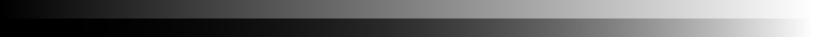

# Report for lab01
## Task:
1. write a console application to generate a single-channel 8bpp img with a "gradient fill"(from 0 to 255, from rectangles s-width, h-height) and gamma-corrected fill
2. strips are arranged on top of each other
3. gamma correction is executed as a function
4. the name of the output file is specified as an optional parameter (without a key) if this parameter is not set, then just show the result on the screen and close the application by pressing any key
5. get the s, h, gamma parameters from the command line parameters, if the keys are not specified, then use the defaults (s=3, h=30, gamma=2.4)
## Code:
```#include <iostream>
#include <opencv2/opencv.hpp>
#include <ReportCreator.h>


// Function for correction color level
int gammaCorrection(double color, double gamma) {
    return (int) (pow(color / 255, gamma) * 255);
}


int main(int argc, char** argv) {
    // Description of the parameters for calling the console application
    cv::CommandLineParser parser(argc, argv,
        "{imgName     |      | output img name}"
        "{s           | 3    | gradient step width}"
        "{h           | 30   | gradient step height}"
        "{gamma       | 2.4  | gamma correction coef}"
    );
    
    // Parsing command line arguments
    cv::String imgName = parser.get<cv::String>("imgName");
    int s = parser.get<int>("s");
    int h = parser.get<int>("h");
    double gamma = parser.get<double>("gamma");

    // Creating an img matrix
    cv::Mat1b img(2 * h, 256 * s, 1);

    // Filling matrix cells by colors
    for (int step = 0; step < 256; step++) { // For each color level (gradient step as a color)
        int correctedColor = gammaCorrection(step, gamma);
        for (int col = s * step; col < s * (step + 1); col++) { // For each col in rectangle
            for (int row = 0; row < h; row++) { // For each row in col of gradient rectangle
                img[row][col] = step;
            }
            for (int row = h; row < 2 * h; row++) { // For each row in col of gamma-corrected gradient rectangle
                img[row][col] = correctedColor;
            } 
        }
    }

    // Saving the img
    try {
        std::string name = imgName == "" ? "default" : imgName;
        cv::imwrite("../export/lab01/" + name + ".png", img);
    } 
    catch (const cv::Exception& ex) {
        std::cerr << "Error: " << ex.what() << std::endl;
    }
}
```
## Process:

В коде определена функция gammaCorrection, которая принимает на вход уровень цвета и значение гамма-коррекции, а возвращает скорректированный уровень цвета.

Используется cv::CommandLineParser для обработки параметров командной строки.
Поддерживаются параметры:
- imgName - имя выходного изображения (по умолчанию не задано).
- s - ширина шага градиента (по умолчанию 3).
- h - высота шага градиента (по умолчанию 30).
- gamma - коэффициент гамма-коррекции (по умолчанию 2.4).

Создаётся матрица изображения cv::Mat1b с высотой 2 * h и шириной 256 * s. 
Заполнение изображения осуществляется двумя циклами: внешний цикл для каждого уровня градиента от 0 до 255, внутренний - для заполнения полос соответствующего цвета.

Для каждого уровня цвета сначала заполняется верхняя половина (оригинальные уровни цвета), затем нижняя половина (гамма-корректированные уровни).

## Results:
Картинка при запуске с дефолтными параметрами:


Картинка при изменении коэффициента gamma=10:


Картинка при изменении параметра wigth:
