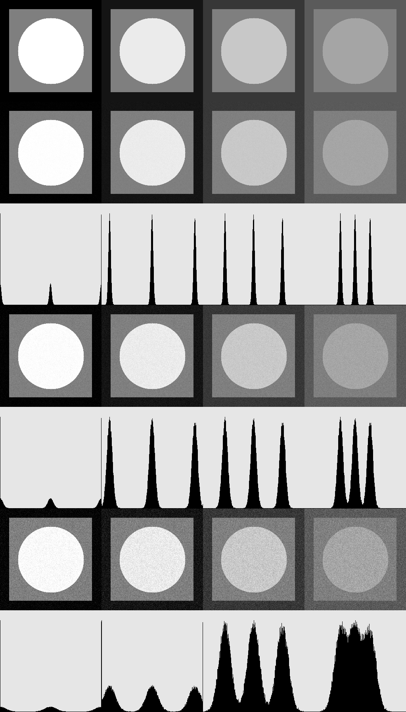

# Report for lab02
## Task:
1. write a function to generate a test img with three brightness levels(256 is the side of the img, 209 is the side of the inner square, 83 is the radius of the circle)
2. write a function to draw a brightness histogram on a square raster with a side of 256 in the form of columns with a width of 1px brightness 0 on a background of 230, normalize so that the maximum value has a height 230
3. write a noise reduction function (additive normal unbiased noise with a given value of the standard deviation)
4. generate test imgs for 4 sets of levels and glue them from left to right
- [0,127,255]
- [20,127,235]
- [55,127,200]
- [90,127,165]
5. generate noisy imgs and histograms that are placed butt-to-butt below the test img
6. make noise for three values of the standard deviation 3, 7, 15
7. glue all imgs into one

## Process:
Генерируется тестовоое изображение по предложенным параметрам размером 256х256. Заданы три уровня яркости: фон, внутренний квадрат и круг. Фон - темный квадрат, внутренний квадрат - уровень яркости из lvl[1], круг - уровень яркости из lvl[2].
```
cv::Mat1b generateImg(const std::vector<int>& lvl) {
    cv::Mat1b img(256, 256, lvl[0]); // Background dark rectangle
    cv::rectangle(img, cv::Rect(23.5, 23.5, 209, 209), lvl[1], -1); // Second rectangle layer
    cv::circle(img, cv::Point(128, 128), 83, lvl[2], -1); // Circle layer

    return img;
}
```

Построение гистограммы яркости размером 256x256 пикселей с фоном яркости 230.
```
cv::Mat drawHistogram(const cv::Mat& img) {
    cv::Mat1b histImg(256, 256, 230); // Background img

    // Calculations
    cv::Mat hist;
    int histSize = 256;
    float range[] = {0, 256};
    const float* histRange = {range};
    bool uniform = true, accumulate = false;
    cv::calcHist(&img, 1, 0, cv::Mat(), hist, 1, &histSize, &histRange, uniform, accumulate);

    // Histogram normalization
    cv::normalize(hist, hist, 0, 230, cv::NORM_MINMAX);

    // Displaying histogram
    for (int i = 0; i < 256; ++i) {
        cv::line(histImg, cv::Point(i, 255), cv::Point(i, 255 - cvRound(hist.at<float>(i))), cv::Scalar(0), 1);
    }

    return histImg;
}
```

Определена функция addGaussianNoise, которая добавляет к изображению нормальный шум с заданным стандартным отклонением. Шум генерируется с помощью cv::RNG и добавляется к исходному изображению.
```
cv::Mat addGaussianNoise(const cv::Mat& img, double stddev) {
    cv::Mat noisyImg = img.clone();
    cv::RNG rng; // Pseudorandom numbers module of the cv library

    // Noise generation
    cv::Mat noise(noisyImg.size(), CV_64FC1);
    rng.fill(noise, cv::RNG::NORMAL, 0, stddev);
    noisyImg += noise;

    return noisyImg;
}
```

Итак, создаются изображения для четырех наборов уровней яркости. Для каждого изображения генерируются зашумленные версии с тремя значениями стандартного отклонения (3, 7, 15). К каждому изображению добавляются соответствующие гистограммы.
```
for (int i = 0; i < 4; i++) {
    cv::Mat1b img = generateImg(lvls[i]);
    cv::Mat1b lvlImg = img.clone();
    for (const auto& std : {3, 7, 15}) {
        cv::Mat1b noisyImg = addGaussianNoise(img, std);
        cv::vconcat(lvlImg, noisyImg, lvlImg);
        cv::vconcat(lvlImg, drawHistogram(noisyImg), lvlImg);
    }
    imgs.push_back(lvlImg);
}
```

После чего все изображения склеиваются. Сверху - оригинальное, после чего парами: зашумлённое тестовое изображение и его гистограмма.
```
cv::Mat1b mainPic = imgs[0].clone();
for (int i = 1; i < 4; i++) {
    cv::hconcat(mainPic, imgs[i], mainPic);
}
```

## Results:


