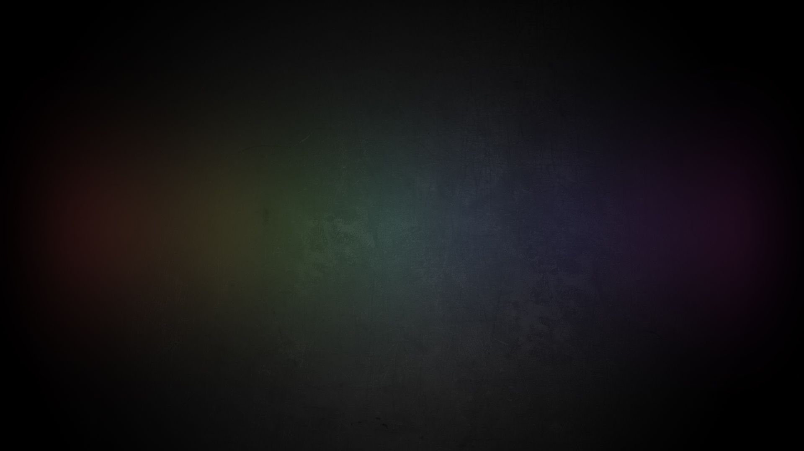
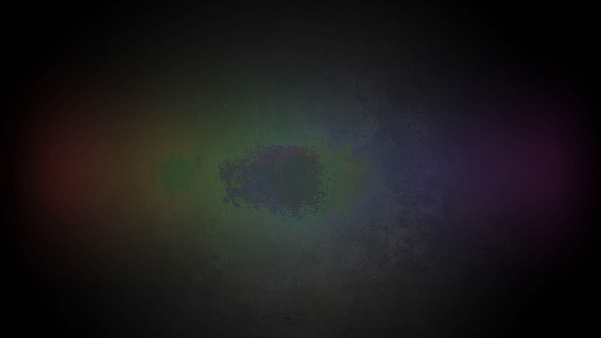
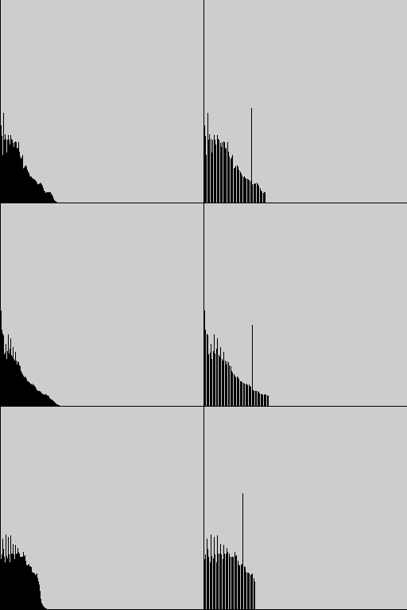
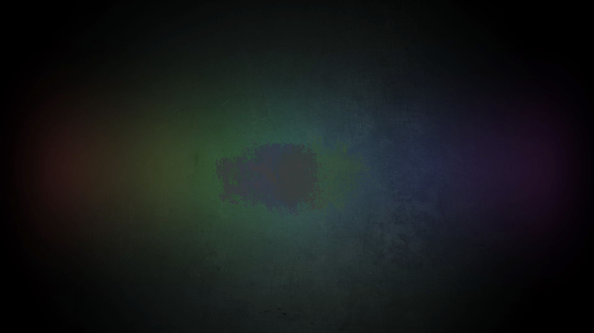
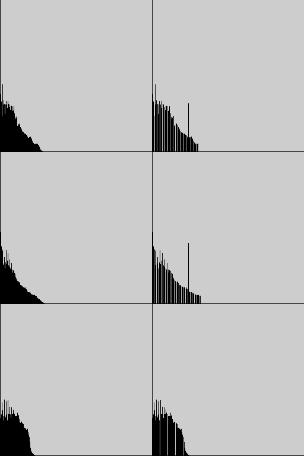
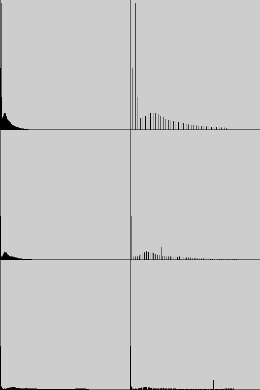
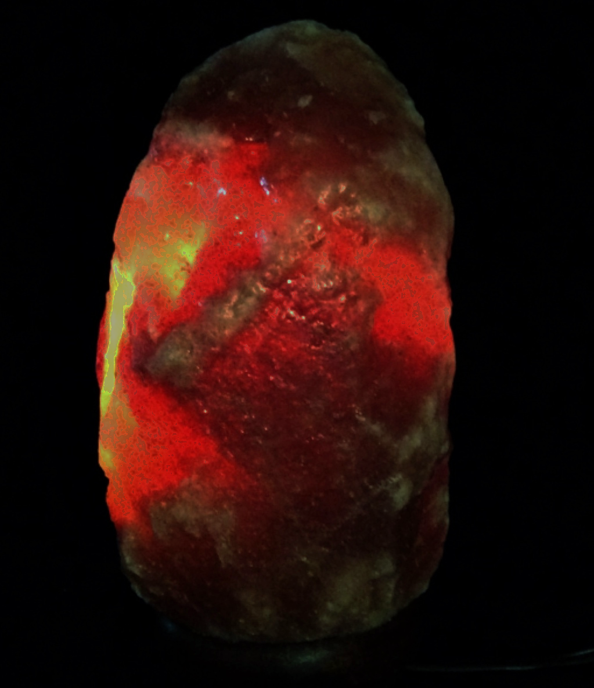
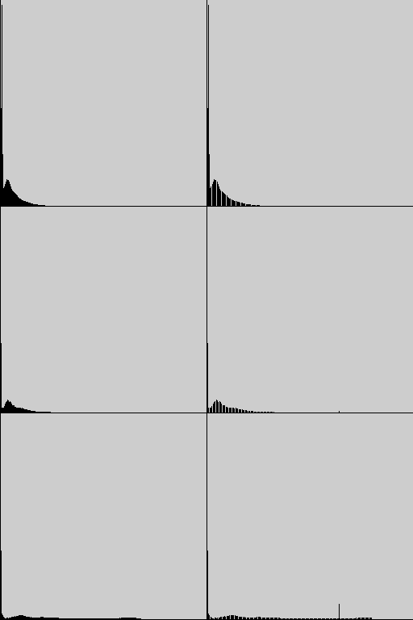
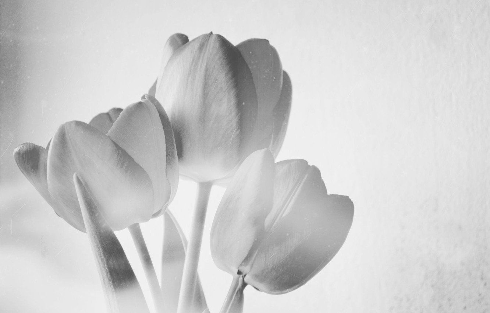
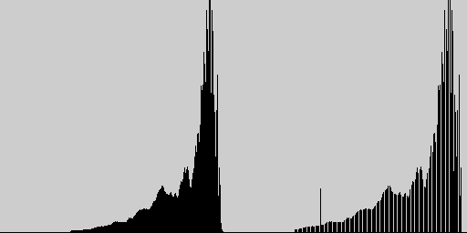

# Report for lab03
## Task:
1. write a function for auto-contrast by quantiles of black and white
2. write functions for auto-contrasting a color image (channel-by-channel and jointly)
3. arrange it in the form of a console application (the type of input image is determined automatically)

## Code:
```#include <iostream>
#include <vector>
#include <opencv2/opencv.hpp>
#include <ReportCreator.h>
#include <filesystem>


// Check if the img is monochromatic
bool isGrayscale(const cv::Mat& img) {
    if (img.channels() == 1) 
        return true;

    for (int i = 0; i < img.rows; i++) {
        for (int j = 0; j < img.cols; j++) {
            cv::Vec3b pixel = img.at<cv::Vec3b>(i, j);
            if (pixel[0] != pixel[1] || pixel[1] != pixel[2])
                return false; 
        }
    }

    return true;
}


// Returns histogram for channel
cv::Mat calcHist(const cv::Mat& img) {
    cv::Mat hist;
    int histSize = 256;
    float range[] = {0, 256};
    const float* histRange = {range};
    bool uniform = true, accumulate = false;
    cv::calcHist(&img, 1, 0, cv::Mat(), hist, 1, &histSize, &histRange, uniform, accumulate);

    return hist;
}


// Returns img of the histogram
cv::Mat drawHist(cv::Mat hist) {
    cv::normalize(hist, hist, 0, 256, cv::NORM_MINMAX);
    cv::Mat histImage(256, 256, 0);
    for (int i = 0; i < 256; i++) {
        cv::line(histImage, cv::Point(i, 255), cv::Point(i, 255 - cvRound(hist.at<float>(i))), cv::Scalar(0), 1);
    }

    return histImage;
}


// Returns levels of white and black
std::pair<int, int> calcQuantiles(const cv::Mat& hist, double quantile) {
    std::pair<int, int> quantiles = {0, 0};
    int pixCount = cv::sum(hist)[0];
    double cumulativeSum = 0;

    for (int i = 0; i < hist.size().height; i++) {
        cumulativeSum += hist.at<float>(i);   
        if (cumulativeSum  >= (quantile * pixCount)) {
            quantiles.first = i;
            break;
        }
    }

    cumulativeSum = 0;
    for (int i = hist.size().height - 1; i >= 0; i--) {
        cumulativeSum += hist.at<float>(i);
        if (cumulativeSum >= (quantile * pixCount)) {
            quantiles.second = i;
            break;
        }
    }

    return quantiles;
}


// Returns new level for pixel
int calculateNewLevel(int c_low, int c_high, int blackQuantile, int whiteQuantile, int currentValue) {
    if (currentValue <= blackQuantile) return blackQuantile;
    if (currentValue >= whiteQuantile) return whiteQuantile;

    return c_low + (currentValue - blackQuantile) * (c_high - c_low) / (whiteQuantile - blackQuantile);
}


// Calculate new values for each pixel in img
cv::Mat recolorChannel(cv::Mat img, int cLow, int cHigh, const std::pair<int, int>& quantiles) {
    for (int y = 0; y < img.rows; y++) {
        for (int x = 0; x < img.cols; x++) {
            int color = calculateNewLevel(cLow, cHigh, quantiles.first, quantiles.second, img.at<uchar>(y,x));
            img.at<uchar>(y,x) = static_cast<uchar>(color);
        }
    }

    return img;
}


// Concat visualisalized histograms of original and new img
cv::Mat concatHists(std::vector<cv::Mat> origHists, std::vector<cv::Mat> newHists) {
    cv::Mat result;
    cv::hconcat(origHists[0], newHists[0], result);
    
    for (int i = 1; i < origHists.size(); i++) {
        cv::Mat tmp;
        cv::hconcat(origHists[i], newHists[i], tmp);
        cv::vconcat(result, tmp, result);
    }

    return result;
}


int main(int argc, char* argv[]) {
    // Parsing console command
    cv::CommandLineParser parser(argc, argv, 
        "{q    | 0.01 | quantile}"
        "{path |      | filepath to img}"
    );
    float quantile = parser.get<float>("q");
    std::string filepath = parser.get<std::string>("path");

    // Reading img
    cv::Mat img = cv::imread(filepath);
    if (img.empty()) {
        std::cerr << "Unable to read image: " << filepath << std::endl;
        return 0;
    }

    // We will have to rewrite the img if we recognise it as monochromatic
    bool isGray = isGrayscale(img);
    if (isGray) {
        cv::cvtColor(img, img, cv::COLOR_BGR2GRAY);
    }

    // Spliting to channels
    std::vector<cv::Mat> channels;
    cv::split(img, channels);
    
    // Getting information about quantiles for each channel
    std::vector<std::pair<int, int>> quantileData;
    std::vector<cv::Mat> origHists;
    int minWhite = 255, maxBlack = 0;
    for (auto& channel : channels) {
        cv::Mat hist = calcHist(channel);
        std::pair<int, int> quantiles = calcQuantiles(hist, quantile);
        minWhite = minWhite > quantiles.first ? quantiles.first : minWhite;
        maxBlack = maxBlack < quantiles.second ? quantiles.second : maxBlack;
        quantileData.push_back(quantiles);
        origHists.push_back(drawHist(hist));
    }

    // Creating new img by updating each channel
    std::vector<cv::Mat> newChannels, newHists, newChannelsGen, newHistsGen;
    for (int i = 0; i < channels.size(); i++) {
        double lowGray, highGray;
        cv::minMaxLoc(channels[i], &lowGray, &highGray);
        newChannels.push_back(recolorChannel(channels[i].clone(), lowGray, highGray, quantileData[i]));
        newHists.push_back(drawHist(calcHist(newChannels[i]))); // updating with their own quantiles
        if (!isGray) {
            newChannelsGen.push_back(recolorChannel(channels[i].clone(), lowGray, highGray, {minWhite, maxBlack}));
            newHistsGen.push_back(drawHist(calcHist(newChannelsGen[i]))); // updating with general quantiles
        }
    }

    // Saving and displaying new imgs 
    std::string filename = std::filesystem::path(filepath).stem().string();
    std::string exportpath = "../export/lab03/" + filename;

    cv::Mat newImg;
    cv::merge(newChannels, newImg);
    cv::imwrite(exportpath + "1orig.png", img);
    cv::imwrite(exportpath + "2scaled.png", newImg);
    cv::imwrite(exportpath + "3scaledhist.png", concatHists(origHists, newHists));
    cv::imshow("newImg", newImg);
    cv::waitKey(0);

    if (!isGray) {
        cv::merge(newChannelsGen, newImg);
        cv::imwrite(exportpath + "4gen.png", newImg);
        cv::imwrite(exportpath + "5genhist.png", concatHists(origHists, newHistsGen));
        cv::imshow("newImgGen", newImg);
        cv::waitKey(0);
    }

    // Creating the report
    ReportCreator("lab03", 
    "1. write a function for auto-contrast by quantiles of black and white\n"
    "2. write functions for auto-contrasting a color image (channel-by-channel and jointly)\n"
    "3. arrange it in the form of a console application (the type of input image is determined automatically)\n");
}
```
## Results:






















