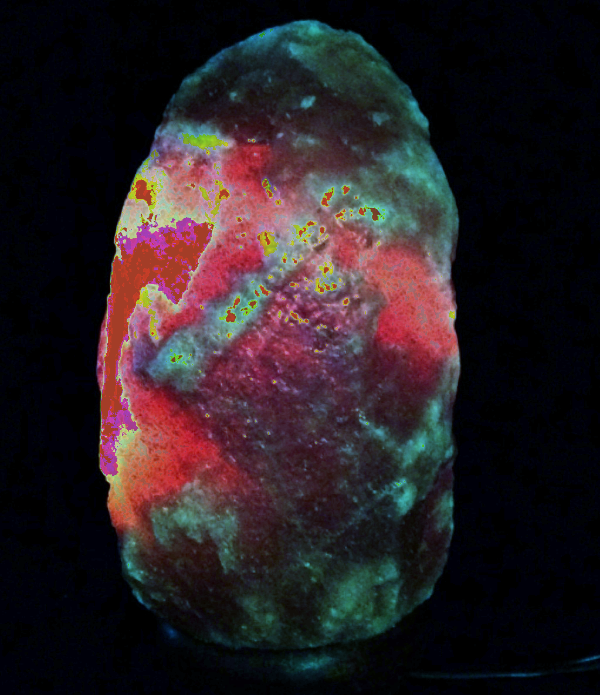
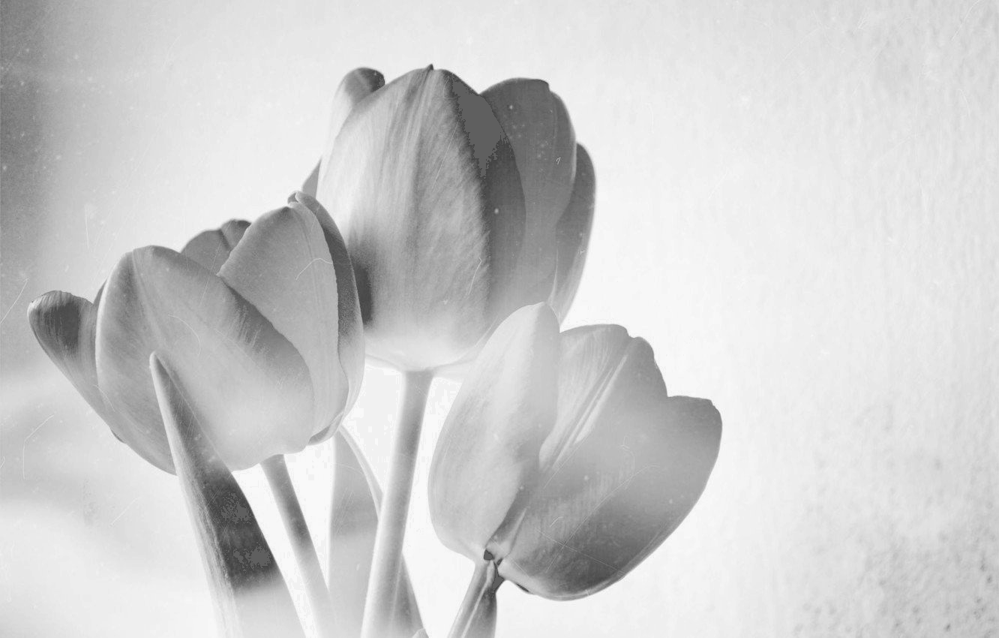

# Report for lab03
## Task:
1. write a function for auto-contrast by quantiles of black and white
2. write functions for auto-contrasting a color image (channel-by-channel and jointly)
3. arrange it in the form of a console application (the type of input image is determined automatically)

## Process:
Определена функция isGrayscale, которая проверяет, является ли изображение монохромным.
Если все каналы (B, G, R) имеют одинаковые значения для всех пикселей, изображение считается монохромным.
```
bool isGrayscale(const cv::Mat& img) {
    if (img.channels() == 1) 
        return true;

    for (int i = 0; i < img.rows; i++) {
        for (int j = 0; j < img.cols; j++) {
            cv::Vec3b pixel = img.at<cv::Vec3b>(i, j);
            if (pixel[0] != pixel[1] || pixel[1] != pixel[2])
                return false; 
        }
    }

    return true;
}
```

Определена функция calcHist, которая рассчитывает гистограмму для заданного канала изображения. Гистограмма имеет 256 уровней яркости.
```
cv::Mat calcHist(const cv::Mat& img) {
    cv::Mat hist;
    int histSize = 256;
    float range[] = {0, 256};
    const float* histRange = {range};
    bool uniform = true, accumulate = false;
    cv::calcHist(&img, 1, 0, cv::Mat(), hist, 1, &histSize, &histRange, uniform, accumulate);

    return hist;
}
```

Определена функция drawHist, которая нормализует гистограмму и рисует её в виде изображения размером 256x256 пикселей.
```
cv::Mat drawHist(cv::Mat hist) {
    cv::normalize(hist, hist, 0, 256, cv::NORM_MINMAX);
    cv::Mat histImage(256, 256, 0);
    for (int i = 0; i < 256; i++) {
        cv::line(histImage, cv::Point(i, 255), cv::Point(i, 255 - cvRound(hist.at<float>(i))), cv::Scalar(0), 1);
    }

    return histImage;
}
```

Определена функция calcQuantiles, которая рассчитывает квантильные значения для заданной гистограммы. Квантильные значения определяют уровни яркости, ниже и выше которых находятся определённые доли всех пикселей.
```
std::pair<int, int> calcQuantiles(const cv::Mat& hist, double quantile) {
    std::pair<int, int> quantiles = {0, 0};
    int pixCount = cv::sum(hist)[0];
    double cumulativeSum = 0;

    for (int i = 0; i < hist.size().height; i++) {
        cumulativeSum += hist.at<float>(i);   
        if (cumulativeSum  >= (quantile * pixCount)) {
            quantiles.first = i;
            break;
        }
    }

    cumulativeSum = 0;
    for (int i = hist.size().height - 1; i >= 0; i--) {
        cumulativeSum += hist.at<float>(i);
        if (cumulativeSum >= (quantile * pixCount)) {
            quantiles.second = i;
            break;
        }
    }

    return quantiles;
}
```

Определена функция recolorChannel, которая применяет новое значение яркости для каждого пикселя в канале изображения на основе квантильных значений.
```
cv::Mat recolorChannel(cv::Mat img, int cLow, int cHigh, const std::pair<int, int>& quantiles) {
    for (int y = 0; y < img.rows; y++) {
        for (int x = 0; x < img.cols; x++) {
            int color = calculateNewLevel(cLow, cHigh, quantiles.first, quantiles.second, img.at<uchar>(y,x));
            img.at<uchar>(y,x) = static_cast<uchar>(color);
        }
    }

    return img;
}
```

Определена функция concatHists, которая объединяет визуализированные гистограммы оригинального и нового изображений.
```
cv::Mat concatHists(std::vector<cv::Mat> origHists, std::vector<cv::Mat> newHists) {
    cv::Mat result;
    cv::hconcat(origHists[0], newHists[0], result);
    
    for (int i = 1; i < origHists.size(); i++) {
        cv::Mat tmp;
        cv::hconcat(origHists[i], newHists[i], tmp);
        cv::vconcat(result, tmp, result);
    }

    return result;
}
```

main:

- Парсинг командной строки для получения пути к изображению и значения квантиля.

- Чтение изображения и проверка на монохромность.


- Разделение изображения на каналы.

- Расчёт квантилей и гистограмм для каждого канала.


- Создание новых изображений путем обновления каждого канала.


## Other results:
###
Оригинал:


После поканального контрастирования:



После совместного контрастирования:


###
Оригинал:


После совместного контрастирования:



