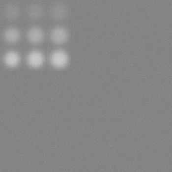
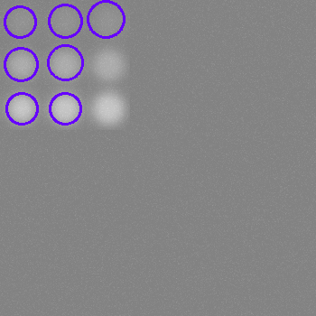
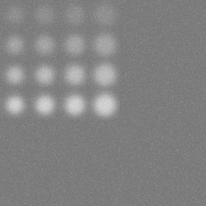
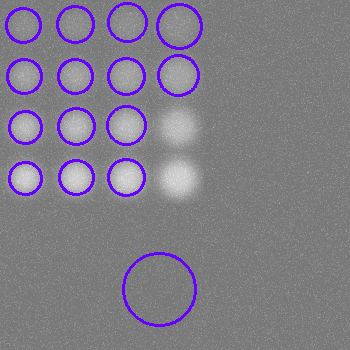
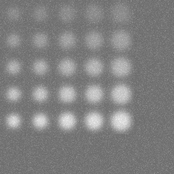
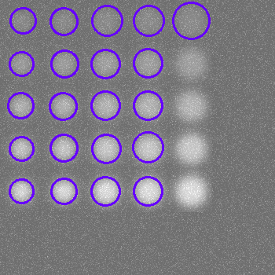
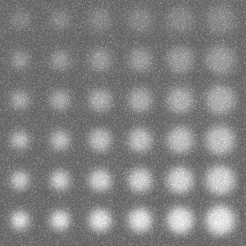
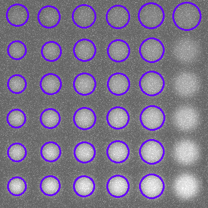

# Report for lab04
## Task:
1. write a function to generate a test image (number of objects of interest, size range, contrast values and degree of blurriness - parameters)
2. write several options for binarization (parameterized)
3. to provide a mode for visual adjustment of binarization parameters (engines in the GUI)
4. write a functional for detection
5. write a functional for quality assessment (based on IoU, at a given level, calculate the number of TP, FP and FN detections)

## Process:
Circle - класс представляет окружность с заданными координатами центра (x, y), радиусом (radius) и цветом (color).
```
class Circle {
    public:
        int x, y, radius, color;
        Circle(int x, int y, int radius, int color) {
            this->x = x;
            this->y = y;
            this->radius = radius;
            this->color = color;            
        }
};
```

DetectionInfo - класс хранит информацию о результатах обнаружения объектов: количество истинно положительных (TP), ложноположительных (FP) и ложноотрицательных (FN) детекций.
```
class DetectionInfo {
    public:
        int TP = 0, FP = 0, TN = 0, FN = 0;
        DetectionInfo() = default;
        DetectionInfo(int TP, int FP, int FN) {
            this->TP = TP;
            this->FP = FP;
            this->FN = FN;
        }
};
```

makeJson - cохраняет информацию об окружностях и параметрах изображения в JSON-файл.
```
void makeJson(int width, int height, int backGroundColor, int blur, int stddev, const std::string& filePath, const std::vector<Circle>& circles) {
    cv::FileStorage fs(filePath, cv::FileStorage::WRITE | cv::FileStorage::FORMAT_JSON);
    fs << "data" << "{"; 
    fs << "objects" << "[";
    for (const auto& circle : circles) {
        fs << "{"; 
        fs << "p" << "[" << circle.x << circle.y << circle.radius << "]";
        fs << "c" << circle.color;
        fs << "}";
    }
    fs << "]";
    fs << "background" << "{";
    fs << "size" << "[" << width << height << "]";
    fs << "color" << backGroundColor << "blur" << blur << "noise" << stddev << "amount" << (int)circles.size();
    fs << "}"; 
    fs << "}";
    fs.release();
}
```

readJson - читает информацию об окружностях и параметрах изображения из JSON-файла.
```
void readJson(int& width, int& height, int& backGroundColor, int& blur, int& stddev, const std::string& filename, std::vector<Circle>& circles) {
    cv::FileStorage fs(filename, cv::FileStorage::READ | cv::FileStorage::FORMAT_JSON);

    cv::FileNode data = fs["data"];

    cv::FileNode objects = data["objects"];
    for (cv::FileNodeIterator it = objects.begin(); it != objects.end(); ++it) {
        cv::FileNode obj = *it;
        cv::FileNode p = obj["p"];
        circles.push_back(Circle(p[0], p[1], p[2], obj["c"]));
    }

    cv::FileNode background = data["background"];
    width = background["size"][0], height = background["size"][1], backGroundColor = background["color"],
        blur = background["blur"], stddev = background["noise"];

    fs.release();
}
```

genImg - cоздаёт изображение с фоном, окружностями, размытием и шумом.
```
cv::Mat genImg(int width, int height, int backGroundColor, int blur, int stddev, const std::vector<Circle>& circles) {
    cv::Mat result = cv::Mat(cv::Size(width, height), CV_8UC1, cv::Scalar(backGroundColor));
    
    int maxRadius = std::max_element(
        circles.begin(), circles.end(), [](const Circle &a, const Circle &b) {return a.radius < b.radius;}
    )->radius; // Searching for the maximum radius of the circle
    int blurScopeSize = maxRadius * 3; // Size of the blur area
    if (blur % 2 == 0) blur++; // Setting the blur parameter (odd value)
    for (const auto& circle : circles) {
        cv::circle(result, cv::Point(circle.x, circle.y), circle.radius, cv::Scalar(circle.color), cv::FILLED);

        // Definition of the blur area
        int xTopAngle = std::max(circle.x - blurScopeSize / 2, 0),
            yTopAngle = std::max(circle.y - blurScopeSize / 2, 0),
            blurWidth = std::min(blurScopeSize, width - xTopAngle),
            blurHeight = std::min(blurScopeSize, height - yTopAngle);
        cv::Rect blurScope(xTopAngle, yTopAngle, blurWidth, blurHeight);

        // Applying Gaussian blur to the selected area
        cv::Mat blurScopeLink = result(blurScope);
        cv::GaussianBlur(blurScopeLink, blurScopeLink, cv::Size(blur, blur), 0);
    }

    // Creating and adding noise to an img
    cv::Mat noise = cv::Mat(height, width, CV_8UC1);
    cv::randn(noise, 0, stddev);
    result += noise;

    return result;
}

```

isValidComponent - проверяет, является ли область связной компоненты валидной по площади: площадь лежит в пределах (0.8 * gtSquare; 1.2 * grSquare)
```
bool isValidComponent(int area, int minRadius, int maxRadius) {
    return (area > 0.8 * CV_PI * minRadius * minRadius && area < 1.2 * CV_PI * maxRadius * maxRadius);
}
```

drawDetection - рисует обнаруженные окружности на изображении и добавляет их в список детекций.
```
void drawDetection(int width, int height, int stddev, 
    const cv::Mat& testImg, std::vector<Circle>& detections, const std::vector<cv::Mat>& componentMasks) {
    cv::Mat bluredResult = cv::Mat(width, height, CV_8UC1);

    // Remove noise to get a more accurate color
    int ksize = stddev % 2 == 1 ? stddev + 2 : stddev + 3;
    cv::GaussianBlur(testImg, bluredResult, cv::Size(ksize, ksize), 0);

    for (auto mask : componentMasks) {
        cv::Mat contour = cv::Mat(testImg.rows, testImg.cols, CV_8UC1);
        contour.setTo(0);
        std::vector<std::vector<cv::Point>> detectedContours, actualContours;
        cv::findContours(mask, detectedContours, cv::RETR_LIST, cv::CHAIN_APPROX_SIMPLE);
        if ((int)detectedContours.size() > 1) {
            int maxSize = -1, maxIndex = 0;
            for (int j = 0; j < detectedContours.size(); j++) {
                if ((int)detectedContours[j].size() > maxSize) {
                    maxSize = (int)detectedContours[j].size();
                    maxIndex = j;
                }
            }
            actualContours.push_back(detectedContours[maxIndex]);
        } else {
            actualContours.push_back(detectedContours[0]);
        }

        float radius;
        cv::Point2f center;
        cv::minEnclosingCircle(actualContours[0], center, radius);
        int detColor = bluredResult.at<cv::Vec3b>(cv::Point((int)center.y, (int)center.x))[0];
        detections.push_back(Circle((int)center.x, (int)center.y, (int)radius, detColor));
    }

    for (auto det : detections) {
        cv::circle(testImg, cv::Point(det.x, det.y), det.radius, cv::Scalar(255, 0, 102), 2);
    }
}
```

calcSingleIOU - вычисляет метрику IoU (Intersection over Union) между эталонной и обнаруженной маской.
```
double calcSingleIOU(const cv::Mat& gtMask, const cv::Mat& mask) {
    cv::Mat intersection, unions;
    cv::bitwise_and(gtMask, mask, intersection);
    cv::bitwise_or(gtMask, mask, unions);
    int intersectionsArea = cv::countNonZero(intersection), unionArea = cv::countNonZero(unions);

    return ((double)intersectionsArea / (double)unionArea);
}
```

genIOUMatrix - генерирует матрицу IoU для всех пар эталонных и обнаруженных окружностей.
```
std::vector<std::vector<double>> genIOUMatrix(int width, int height, 
    const std::vector<Circle>& circles, const std::vector<Circle>& detections) {
    cv::Mat gtImg(width, height, CV_8UC1, cv::Scalar(0)), detImg(width, height, CV_8UC1, cv::Scalar(0)), 
        gtLabeled, detLabels;

    // Gen bin gt img
    for (auto circle : circles) 
        cv::circle(gtImg, cv::Point(circle.x, circle.y), circle.radius, cv::Scalar(255), cv::FILLED);
    cv::connectedComponents(gtImg, gtLabeled, 8);

    // Gen bin detections img
    for (auto circle : detections) {
        cv::circle(detImg, cv::Point(circle.x, circle.y), circle.radius, cv::Scalar(255), cv::FILLED);
    }
    cv::connectedComponents(detImg, detLabels, 8);
    std::vector<cv::Mat> detMasks;
    for(int i = 1; i <= detections.size(); i++) {
        cv::Mat mask = (detLabels == i + 1);
        detMasks.push_back(mask);
    }

    // Compare the detections with the standards
    std::vector<std::vector<double>> ious(detMasks.size(), std::vector<double>(circles.size(), (float)(-1)));
    for (int i = 0; i < detMasks.size(); i++) {
        cv::Mat singleDetComponentMask = detMasks[i];
        for (int j = 0; j < circles.size(); j++) {
            cv::Mat gtMask = (gtLabeled == j + 1);
            ious[i][j] = calcSingleIOU(gtMask, singleDetComponentMask);
        }
    }

    return ious;
}
```

estimateDetections - оценивает результаты обнаружений (TP, FP, FN) на основе матрицы IoU и заданного порогового значения качества.
```
DetectionInfo estimateDetections(const std::vector<std::vector<double>>& ious) {
    DetectionInfo result;

    for (auto row : ious) {
        if (!std::any_of(row.begin(), row.end(), [](double iou) { return iou >= TRESHOLD_QUALITY; })) {
            result.FP++;
        }
    }

    for (int j = 0; j < ious[0].size(); j++) {
        bool TruePositive = false;
        for (int i = 0; i < ious.size(); i++) {
            if (ious[i][j] >= TRESHOLD_QUALITY) {
                TruePositive = true;
                break;
            }
        }
        if (TruePositive) {
            result.TP++;
        }
        else {
            result.FN++;
        }
    }

    return result;
}

```

componentsDetector - выполняет обнаружение объектов на изображении, используя метод связных компонент и пороговое преобразование. Оценивает качество обнаружений на основе матрицы IoU и порогового значения качества.
```
void componentsDetector(int width, int height, int stddev, int minRadius, int maxRadius,
    const cv::Mat& testImg, std::vector<Circle>& detections, cv::Mat& imgWithDetections, const std::vector<Circle>& circles) {
    cv::Mat result = cv::Mat(width, height, CV_8UC1), binImg, centroids, stats, labels;
    std::vector<cv::Mat> masks;

    // Remove noise
    int ksize = stddev % 2 == 1 ? stddev + 2 : stddev + 3;
    cv::GaussianBlur(testImg, result, cv::Size(ksize, ksize), 0);

    // Binarize the img
    cv::adaptiveThreshold(result, binImg, 255, cv::ADAPTIVE_THRESH_GAUSSIAN_C, cv::THRESH_BINARY, BLOCK_SIZE, 0);

    // Get information about the reference circles
    cv::connectedComponentsWithStats(binImg, labels, stats, centroids);

    // Find all valid detection masks
    for (int i = 1; i < stats.rows; i++) {
        if (isValidComponent(stats.at<int>(i, cv::CC_STAT_AREA), minRadius, maxRadius)) {
            // Create mask with single component(detection)
            cv::Mat singleDetComponentMask = (labels == i);
            masks.push_back(singleDetComponentMask);
        }
    }

    imgWithDetections = testImg.clone();
    cv::cvtColor(testImg, imgWithDetections, cv::COLOR_GRAY2BGR);

    drawDetection(width, height, stddev, imgWithDetections, detections, masks);
    
    std::vector<std::vector<double>> ious = genIOUMatrix(width, height, circles, detections);

    DetectionInfo detectionInfo = estimateDetections(ious);
    std::cout << "\tTP: " << detectionInfo.TP << std::endl;
    std::cout << "\tFP: " << detectionInfo.FP << std::endl;
    std::cout << "\tFN: " << detectionInfo.FN << std::endl;
    std::cout << "\tQuality: " << 
        (double)detectionInfo.TP / (double)(detectionInfo.TP + detectionInfo.FP + detectionInfo.FN) << std::endl;
}
```

main()
- Инициализирует начальные параметры изображения и окружностей. К примеру: circlesInRow = 3, minRadius = 14, maxRadius = 16, minColor = 145, maxColor = 225, stddev = 5, blur = 33, backGroundColor = 130, width = 350, height = 350;
- В цикле создаёт несколько тестовых изображений с разными окружностями и параметрами.



- Для каждого изображения:
- Генерирует информацию об окружностях и сохраняет её в JSON-файл.
```
    for(int i = 1; i < 5; i++) {
        std::vector<Circle> circles, detections;

        // Genering info about objects
        int circleColor = minColor, 
            coordinateStep = 3 * maxRadius, 
            colorStep = (maxColor - minColor) / circlesInRow, 
            imgSize = circlesInRow * coordinateStep,
            current_x = coordinateStep / 2, 
            current_y = coordinateStep / 2;
        while (current_y + maxRadius <= imgSize) {
            for (int i = 0; i < circlesInRow; i++) {
                int radius = minRadius + i * (maxRadius - minRadius) / (circlesInRow - 1);
                circles.push_back(Circle(current_x, current_y, radius, circleColor));
                current_x += coordinateStep;
                if (current_x >= imgSize) {
                    current_x = coordinateStep / 2;
                    current_y += coordinateStep;
                }
            }
            circleColor += colorStep;
        }

        // Saving inf
        makeJson(width, height, backGroundColor, blur, stddev, folder + "ground_truth" + std::to_string(i) + ".json", circles);
    }
```

- Создаёт изображение с окружностями, размытием и шумом.
- Выполняет обнаружение окружностей.
```
    componentsDetector(width, height, stddev, minRadius, maxRadius, gtImg, detections, imgWithDetections, circles);
```



- Оценивает качество обнаружений и сохраняет результаты в текстовый файл.

- Изменяет параметры генерации для следующего шага цикла.
```
    circlesInRow++;
    minRadius--;
    maxRadius++;
    minColor -=5;
    maxColor += 5;
    stddev += 6;
    backGroundColor -= 10;
```

## Other results:













