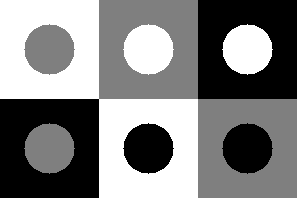
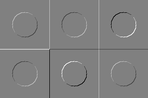
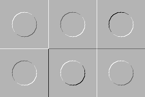
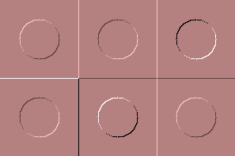

# Report for lab05
## Task:
1. write a function to generate all variants of a circle on a square background (for gray levels 0, 127, 255), the size of the square is 99, the radius of the circle is 25, the circle is in the center of the square. The squares form a rectangle (3 columns, 2 rows)
2. set two cores for linear filtering: {1, 0, 0, -1}, {0, 1, -1, 0}
3. obtain images I1 and I2 by linear filtering with the specified cores
4. get the image I3 = sqrt(I1^2 + I2^2)
5. get an RGB image for visualization by placing it in channels I1, I2 and I3
## Code:
```#include <iostream>
#include <vector>
#include <opencv2/opencv.hpp>
#include <ReportCreator.h>


// Generate a circle in a square
cv::Mat1f squareCirleImg(int squareColor, int circleColor, int squareSide = 99, int radius = 25) {
    cv::Mat1f img(squareSide, squareSide, squareColor);
    cv::Point centre(squareSide / 2, squareSide / 2);
    cv::circle(img, centre, radius, circleColor, cv::FILLED);

    return img;
}


// Unite six different pics containing the given colors
cv::Mat1f genTestImage(int col1 = 0, int col2 = 127, int col3 = 255) {
    cv::Mat1f result, tmp;

    cv::vconcat(squareCirleImg(col3, col2), squareCirleImg(col1, col2), result); // 1st col
    cv::vconcat(squareCirleImg(col2, col3), squareCirleImg(col3, col1), tmp); //2nd col
    cv::hconcat(result, tmp, result);
    cv::vconcat(squareCirleImg(col1, col3), squareCirleImg(col2, col1), tmp); //3rd col
    cv::hconcat(result, tmp, result);

    return result;
}


int main() {
    cv::Mat1f testImg = genTestImage();
    std::vector<cv::Mat1f> newImgs(2);
    cv::Mat cores[2] = {
        (cv::Mat_<float>(2, 2) << 1, 0, 0, -1), 
        (cv::Mat_<float>(2, 2) << 1, 0, 0, -1),
    };

    // Making new imgs by linear filtering testImg
    for (int i = 0; i < 2; i++) {
        cv::filter2D(testImg.clone(), newImgs[i], -1, cores[i]);

        double locMin, locMax;
        cv::minMaxLoc(newImgs[i], &locMin, &locMax);
        newImgs[i] = newImgs[i] * (255 / (locMax - locMin)) + locMax / 2;
    }

    // Making special img3 = (img1 ^ 2 + img2 ^ 2) ^ 0.5
    newImgs.push_back(testImg.clone());
    for (int i = 0; i < testImg.rows; i++) {
        for (int j = 0; j < testImg.cols; j++) {
            newImgs[2][i][j] = sqrt(
                newImgs[0][i][j] * newImgs[0][i][j] + newImgs[1][i][j] * newImgs[1][i][j]
            );
        }
    }

    // Convering imgs of type <Mat1f> to <Mat1b>
    cv::Mat rgbResult;
    std::vector<cv::Mat1b> channels(3);
    std::string exportpath = "../export/lab05/";
    for (int i = 0; i < 3; i++) {
        newImgs[i].convertTo(channels[i], CV_8U);            
        cv::imwrite(
            exportpath + std::to_string(i + 2) + "-core" + std::to_string(i + 1) + ".png", channels[i]
        ); // Saving transformed imgs in cycle
    }
    cv::merge(channels, rgbResult);

    // Saving and displaying test and result imgs
    cv::imshow("testImg", cv::Mat1b(testImg));
    cv::imwrite(exportpath + "1-testImg.png", testImg);
    cv::waitKey(0);
    cv::imshow("rgbResult", rgbResult);
    cv::imwrite(exportpath + "5-rgbResult.png", rgbResult);
    cv::waitKey(0);
}
```
## Results:









