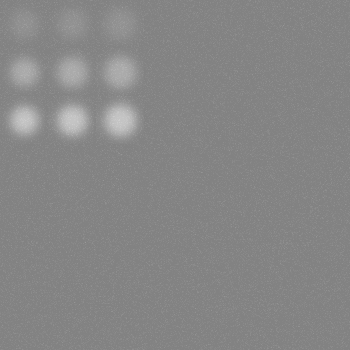
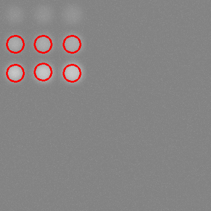
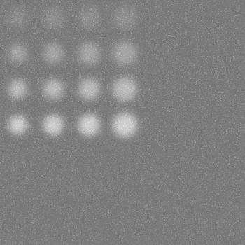
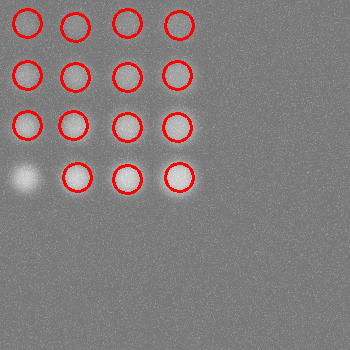
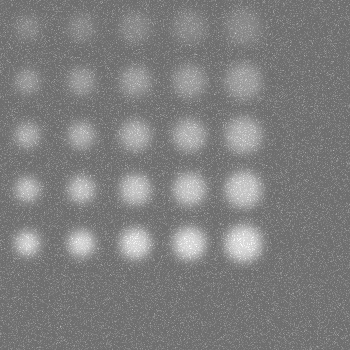
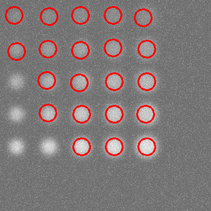
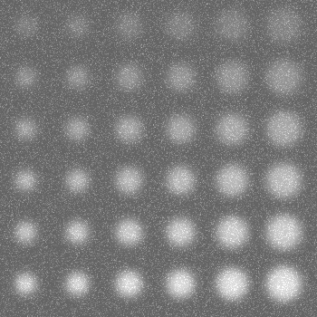
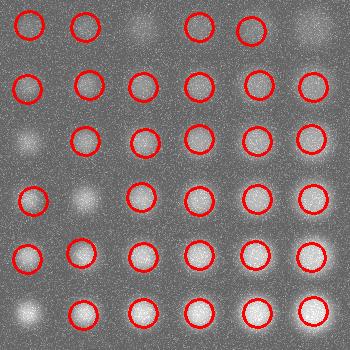

# Report for lab06
## Task:
1. implement an object detector using the Hough Transform size range, contrast values and degree of blurriness - parameters
2. implement FRAC analysis of results
3. compare methods 4 and 6 laboratory

## Process:
Circle - класс представляет окружность с заданными координатами центра (x, y), радиусом (radius) и цветом (color).
```
class Circle {
    public:
        int x, y, radius, color;
        Circle(int x, int y, int radius, int color) {
            this->x = x;
            this->y = y;
            this->radius = radius;
            this->color = color;            
        }
};
```

DetectionInfo - класс хранит информацию о результатах обнаружения объектов: количество истинно положительных (TP), ложноположительных (FP) и ложноотрицательных (FN) детекций.
```
class DetectionInfo {
    public:
        int TP = 0, FP = 0, TN = 0, FN = 0;
        DetectionInfo() = default;
        DetectionInfo(int TP, int FP, int FN) {
            this->TP = TP;
            this->FP = FP;
            this->FN = FN;
        }
};
```

makeJson - cохраняет информацию об окружностях и параметрах изображения в JSON-файл.
```
void makeJson(int width, int height, int backGroundColor, int blur, int stddev, const std::string& filePath, const std::vector<Circle>& circles) {
    cv::FileStorage fs(filePath, cv::FileStorage::WRITE | cv::FileStorage::FORMAT_JSON);
    fs << "data" << "{"; 
    fs << "objects" << "[";
    for (const auto& circle : circles) {
        fs << "{"; 
        fs << "p" << "[" << circle.x << circle.y << circle.radius << "]";
        fs << "c" << circle.color;
        fs << "}";
    }
    fs << "]";
    fs << "background" << "{";
    fs << "size" << "[" << width << height << "]";
    fs << "color" << backGroundColor << "blur" << blur << "noise" << stddev << "amount" << (int)circles.size();
    fs << "}"; 
    fs << "}";
    fs.release();
}
```

readJson - читает информацию об окружностях и параметрах изображения из JSON-файла.
```
void readJson(int& width, int& height, int& backGroundColor, int& blur, int& stddev, const std::string& filename, std::vector<Circle>& circles) {
    cv::FileStorage fs(filename, cv::FileStorage::READ | cv::FileStorage::FORMAT_JSON);

    cv::FileNode data = fs["data"];

    cv::FileNode objects = data["objects"];
    for (cv::FileNodeIterator it = objects.begin(); it != objects.end(); ++it) {
        cv::FileNode obj = *it;
        cv::FileNode p = obj["p"];
        circles.push_back(Circle(p[0], p[1], p[2], obj["c"]));
    }

    cv::FileNode background = data["background"];
    width = background["size"][0], height = background["size"][1], backGroundColor = background["color"],
        blur = background["blur"], stddev = background["noise"];

    fs.release();
}
```

genImg - cоздаёт изображение с фоном, окружностями, размытием и шумом.
```
cv::Mat genImg(int width, int height, int backGroundColor, int blur, int stddev, const std::vector<Circle>& circles) {
    cv::Mat result = cv::Mat(cv::Size(width, height), CV_8UC1, cv::Scalar(backGroundColor));
    
    int maxRadius = std::max_element(
        circles.begin(), circles.end(), [](const Circle &a, const Circle &b) {return a.radius < b.radius;}
    )->radius; // Searching for the maximum radius of the circle
    int blurScopeSize = maxRadius * 3; // Size of the blur area
    if (blur % 2 == 0) blur++; // Setting the blur parameter (odd value)
    for (const auto& circle : circles) {
        cv::circle(result, cv::Point(circle.x, circle.y), circle.radius, cv::Scalar(circle.color), cv::FILLED);

        // Definition of the blur area
        int xTopAngle = std::max(circle.x - blurScopeSize / 2, 0),
            yTopAngle = std::max(circle.y - blurScopeSize / 2, 0),
            blurWidth = std::min(blurScopeSize, width - xTopAngle),
            blurHeight = std::min(blurScopeSize, height - yTopAngle);
        cv::Rect blurScope(xTopAngle, yTopAngle, blurWidth, blurHeight);

        // Applying Gaussian blur to the selected area
        cv::Mat blurScopeLink = result(blurScope);
        cv::GaussianBlur(blurScopeLink, blurScopeLink, cv::Size(blur, blur), 0);
    }

    // Creating and adding noise to an img
    cv::Mat noise = cv::Mat(height, width, CV_8UC1);
    cv::randn(noise, 0, stddev);
    result += noise;

    return result;
}

```

estimateDetections - оценивает результаты обнаружений (TP, FP, FN) на основе матрицы IoU и заданного порогового значения качества.
```
DetectionInfo estimateDetections(const std::vector<std::vector<double>>& ious) {
    DetectionInfo result;

    for (auto row : ious) {
        if (!std::any_of(row.begin(), row.end(), [](double iou) { return iou >= TRESHOLD_QUALITY; })) {
            result.FP++;
        }
    }

    for (int j = 0; j < ious[0].size(); j++) {
        bool TruePositive = false;
        for (int i = 0; i < ious.size(); i++) {
            if (ious[i][j] >= TRESHOLD_QUALITY) {
                TruePositive = true;
                break;
            }
        }
        if (TruePositive) {
            result.TP++;
        }
        else {
            result.FN++;
        }
    }

    return result;
}

```

calcSingleIOU - вычисляет метрику IoU (Intersection over Union) между эталонной и обнаруженной маской.
```
double calcSingleIOU(const cv::Mat& gtMask, const cv::Mat& mask) {
    cv::Mat intersection, unions;
    cv::bitwise_and(gtMask, mask, intersection);
    cv::bitwise_or(gtMask, mask, unions);
    int intersectionsArea = cv::countNonZero(intersection), unionArea = cv::countNonZero(unions);

    return ((double)intersectionsArea / (double)unionArea);
}
```

genIOUMatrix - генерирует матрицу IoU для всех пар эталонных и обнаруженных окружностей.
```
std::vector<std::vector<double>> genIOUMatrix(int width, int height, 
    const std::vector<Circle>& circles, const std::vector<Circle>& detections) {
    cv::Mat gtImg(width, height, CV_8UC1, cv::Scalar(0)), detImg(width, height, CV_8UC1, cv::Scalar(0)), 
        gtLabeled, detLabels;

    // Gen bin gt img
    for (auto circle : circles) 
        cv::circle(gtImg, cv::Point(circle.x, circle.y), circle.radius, cv::Scalar(255), cv::FILLED);
    cv::connectedComponents(gtImg, gtLabeled, 8);

    // Gen bin detections img
    for (auto circle : detections) {
        cv::circle(detImg, cv::Point(circle.x, circle.y), circle.radius, cv::Scalar(255), cv::FILLED);
    }
    cv::connectedComponents(detImg, detLabels, 8);
    std::vector<cv::Mat> detMasks;
    for(int i = 1; i <= detections.size(); i++) {
        cv::Mat mask = (detLabels == i + 1);
        detMasks.push_back(mask);
    }

    // Compare the detections with the standards
    std::vector<std::vector<double>> ious(detMasks.size(), std::vector<double>(circles.size(), (float)(-1)));
    for (int i = 0; i < detMasks.size(); i++) {
        cv::Mat singleDetComponentMask = detMasks[i];
        for (int j = 0; j < circles.size(); j++) {
            cv::Mat gtMask = (gtLabeled == j + 1);
            ious[i][j] = calcSingleIOU(gtMask, singleDetComponentMask);
        }
    }

    return ious;
}
```

Анализ FRAC (рабочей характеристики приемника с свободным откликом) позволяет оценить эффективность обнаружения объектов при различных пороговых значениях. Как правило, он включает в себя построение графика и расчет показателей на основе результатов обнаружения. Эта функция вычисляет площадь под кривой ROC на основе ряда точек. Каждая точка представлена парой значений (чувствительность, 1/ложноположительные срабатывания на изображение). Площадь под этой кривой дает общую оценку эффективности обнаружения.
```
double calculateFROC(const std::vector<std::pair<double, double>>& points) {
    double area = 0.0;
    for (int i = 1; i < points.size(); ++i) {
        double width = points[i].second - points[i - 1].second;
        double height = (points[i].first + points[i - 1].first) / 2.0;
        area += width * height;
    }

    return area;
}
```

houghDetector - функция использует входное изображение getimage в оттенках серого, применяет размытие по Гауссу для уменьшения шума, а затем обнаруживает круги, используя функцию cv::HoughCircles из OpenCV. Обнаруженные окружности рисуются в detectionsImg и сохраняются в векторе обнаружений как экземпляры пользовательской структуры окружностей.
```
void houghDetector(const cv::Mat& gtImg, cv::Mat& detectionsImg, std::vector<Circle>& detections,
    int minRadius, int maxRadius, int distanceRate = 8, int param1 = 30, int param2 = 45) {
    cv::Mat blurredImg;
    std::vector<cv::Vec3f> circles;

    cv::GaussianBlur(gtImg, blurredImg, cv::Size(11, 11), 0);

    double minDistance = blurredImg.rows / distanceRate;
    double accResolution = 2.;
    cv::HoughCircles(blurredImg, circles, cv::HOUGH_GRADIENT, accResolution, minDistance, param1, param2, minRadius, maxRadius);
    
    cv::cvtColor(gtImg, detectionsImg, cv::COLOR_GRAY2BGR);
    for (auto circle : circles) {
        cv::circle(detectionsImg, cv::Point2f(circle[0], circle[1]), circle[2], cv::Scalar(0, 0, 255), 2);
        detections.push_back(Circle((int)circle[0], (int)circle[1], (int)circle[2], 255));
    }
}
```

main()
- Инициализируем параметры int circlesInRow = 3, minRadius = 14, maxRadius = 16, minColor = 145, maxColor = 225, stddev = 5, blur = 33, backGroundColor = 130, width = 350, height = 350, amount = 4;

- Считываем изображение по json из 4 лабораторной работы
```
    readJson(width, height, backGroundColor, blur, stddev, amount,
        folder + "lab04/ground_truth" + std::to_string(i) + ".json", circles);

    cv::Mat gtImg = genImg(width, height, backGroundColor, blur, stddev, circles), imgWithDetections;
```


- Детектируем. В качестве двух параметров для HoughCircles были переданы значения 15 и 20 соответственно.
```
    houghDetector(gtImg, imgWithDetections, detections, minRadius, maxRadius, 8, 15, 20);
```


## Other results:












